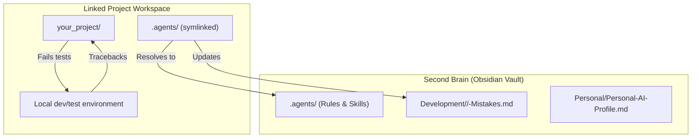

# AI Second Brain Blueprint

This document outlines a vault + linked-workspace architecture for turning an Obsidian vault (or any plain folder of markdown) into a single source of truth for **all your AI coding tools** (Claude Code, Cursor, other CLI agents, and web UIs like ChatGPT/Claude).

Using this structure, every AI agent reads your personal preferences and developer rules up front, and **saves its learnings back into this vault** instead of scattering them randomly across projects.

---

## 📂 Vault Directory Structure

```text
your-vault/                        <-- your second brain
├── .agents/
│   ├── AGENTS.md                  # Global AI behavior, style, and safety constraints
│   ├── skills/                    # Custom AI instructions (skill packs, one folder per skill)
│   └── scripts/
│       └── link-brain.sh          # Link script — wires this vault into a project workspace
├── Development/
│   └── <Domain>/
│       ├── <Domain>-Mistakes.md   # Bugs & framework rules (the agent's persistent memory)
│       ├── Mistakes/              # Module/project-specific structural notes and ledgers
│       └── Notes/                 # Study notes and concepts
├── Personal/
│   ├── Personal-AI-Profile.md     # Your personal role, preferences, and working style
│   ├── Templates/
│   │   └── Daily-Note-Template.md # Daily log template
│   ├── Tasks/
│   │   └── YYYY-MM-DD-[slug].md   # AC/DoD task notes created by /start-work
│   └── Daily-Logs/
│       └── [YYYY-MM-DD].md        # Daily logs (human-reviewed, not agent context)
```

---

## 🏛️ Architecture: Vault + Linked Workspaces

This setup separates your work environment into two parts:
1. **The vault:** where you store your rules, skills, and mistakes/learnings logs — the persistent, cross-project memory.
2. **Linked workspaces:** the various project directories where actual coding work happens.

To make an agent working in a **linked workspace** read/write from/to the **vault**, `link-brain.sh` creates a symbolic link (`.agents/`) from the vault into the local codebase.



---

## ⚙️ How to Connect an AI Tool to Your Vault

### 1. Claude Code (CLI)
- Run `link-brain.sh` in your active project directory.
- This symlinks `.agents/`, `.claude/commands`, and `.claude/agents` into the project, and generates a `CLAUDE.md` pointing at your vault's `AGENTS.md`.

### 2. Cursor IDE
Cursor looks for a `.cursorrules` file in the project root to govern AI chat and inline code generation.
- Run `link-brain.sh` to generate a `.cursorrules` file.
- This instructs Cursor's models to read your vault's `AGENTS.md` and mistakes log for context.

### 3. Other CLI agents
The same symlink pattern generalizes to any tool that reads a project-root instructions file — point that file at `<VAULT_ROOT>/.agents/AGENTS.md` and any relevant mistakes/learnings log.

### 4. Web UIs (ChatGPT / Claude web, etc.)
For web-based AI systems, follow this workflow:
1. **Projects / Custom Instructions:** copy the contents of `Personal-AI-Profile.md` and paste it into Custom Instructions or a Project.
2. **First prompt initialization:**
   ```markdown
   I have attached my Personal-AI-Profile.md and <Domain>-Mistakes.md files.
   Read them to align your behavior, code style, and safety rules.
   Whenever you suggest a code fix, output a markdown entry for <Domain>-Mistakes.md
   that I can append to my second brain.
   ```

---

## 🚀 The Link Script (`link-brain.sh`)

An executable script at `.agents/scripts/link-brain.sh`.

### How to use it:
When starting work on a new project directory:
1. Open your terminal in the project directory.
2. Run the script, pointing `VAULT_ROOT` at your vault (or edit the default inside the script):
   ```bash
   VAULT_ROOT=~/second-brain ~/second-brain/.agents/scripts/link-brain.sh .
   ```
3. The script symlinks your `.agents` folder and `.claude/commands` + `.claude/agents`, and generates `.cursorrules` + `CLAUDE.md` pointing back at the vault.

---

## 🔄 Self-Documenting Flow (The Healing Loop)

Whenever a developer or agent encounters a compilation/test/runtime error:

1. **Don't blow away expensive local state** (databases, containers) unless truly necessary. Prefer incremental commands (e.g. an upgrade/migrate flag) over a full reset.
2. **Capture tracebacks:** read the exact error.
3. **Write the fix:** apply the fix in the active workspace.
4. **Log the learning:** run `brain-sync` (or edit the mistakes file manually) to document the mistake and its solution.
5. **Re-test:** repeat until the command exits clean.

See `.agents/AGENTS.md` for the full rule set (read-only constraints, the self-healing loop with its repeated-error guard, memory routing, token preservation, and the SAFe-style dev-loop agents).
